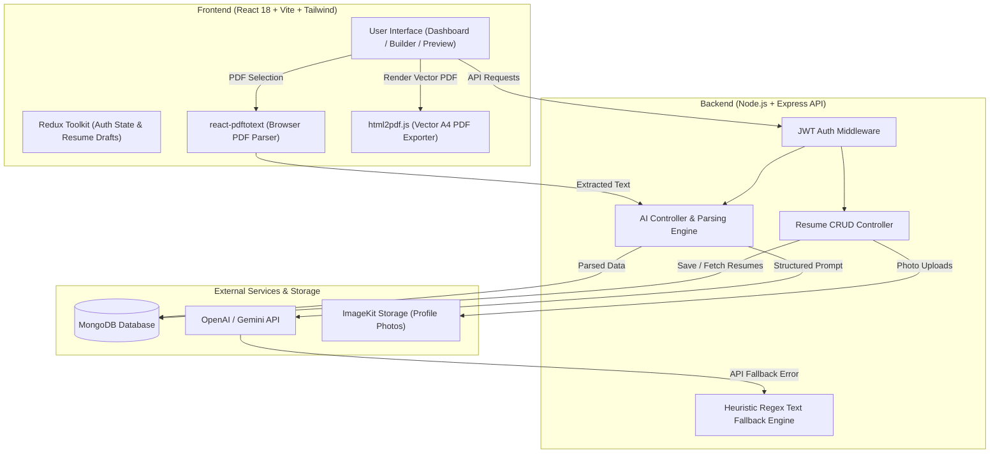
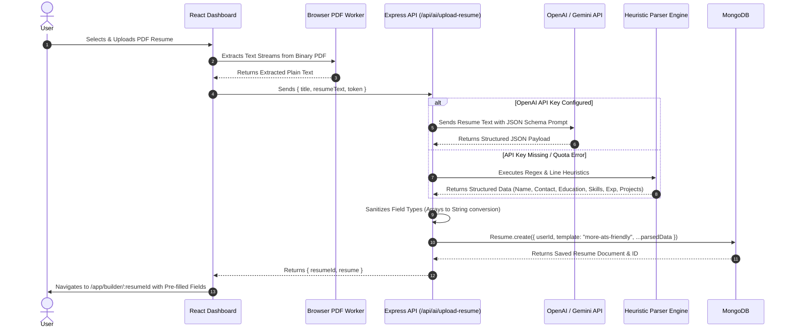

# 📄 AI Resume Builder — ATS-Optimized Resume Creator & PDF Exporter

An AI-powered, full-stack web application for creating, customizing, parsing, and exporting professional ATS-friendly resumes. Built with **React 18**, **Tailwind CSS**, **Node.js**, **Express**, **MongoDB**, and **OpenAI / Gemini API**.

---

## 🌟 Key Features

* 📄 **Import Existing Resume (PDF Upload & Parse)**: Upload any existing PDF resume to automatically extract contact information, education (including GPA & coursework), skills, experience, projects, and certifications directly into editable builder fields.
* 🎨 **Recruiter-Approved ATS Templates**:
  * **More ATS Friendly**: High-converting serif layout with full-width underline section dividers, clean bullets, and 100% parser compliance.
  * **Classic / Professional**: Traditional corporate layout with structured dividers.
  * **Modern SaaS**: Electric accent header blocks with pill tag highlights.
  * **Minimalist**: High contrast typography with ample whitespace.
  * **Creative / Profile**: Dual-column studio layout with photo support.
  * **ATS Optimized**: Single-column maximum score parser layout.
* 🚀 **100% Free Vector PDF Export**: Generates exact A4 vector PDFs (`210mm x 297mm`) directly in the browser with zero watermarks or pagination cuts.
* 🤖 **AI Content Enhancement**: One-click AI enhancement for professional summaries and job experience bullet points with built-in heuristic fallback engine.
* 💅 **Real-Time Styling Controls**: Instant customization for accent colors, typography fonts (Outfit, Inter, Merriweather, Georgia), font sizes, and line spacing.
* 🔐 **Secure JWT Authentication**: User registration, login, bcrypt password hashing, and protected REST API endpoints.

---

## 🏗️ System Architecture



---

## 🔄 End-to-End Data Flow

### 1. Resume Parsing Flow (PDF Import)


---

## 📁 Repository Structure

```
resume-builder/
├── client/                      # React Frontend Application
│   ├── public/                  # Public Static Assets
│   │   ├── favicon.ico          # Browser Tab Icon (Emblem)
│   │   ├── favicon.svg          # Vector Favicon Icon
│   │   └── logo.svg             # Main Brand Logo
│   ├── src/
│   │   ├── app/                 # Redux Store & Auth Slices
│   │   ├── assets/              # Component Assets & Templates
│   │   ├── components/          # Reusable UI & Form Components
│   │   │   ├── templates/       # ATS Resume Template Components
│   │   │   │   ├── MoreATSFriendlyTemplate.jsx
│   │   │   │   ├── ATSTemplate.jsx
│   │   │   │   ├── ClassicTemplate.jsx
│   │   │   │   ├── ModernTemplate.jsx
│   │   │   │   ├── MinimalTemplate.jsx
│   │   │   │   └── MinimalImageTemplate.jsx
│   │   │   ├── EducationForm.jsx
│   │   │   ├── ExperienceForm.jsx
│   │   │   ├── PersonalInfoForm.jsx
│   │   │   ├── ProjectForm.jsx
│   │   │   ├── ResumePreview.jsx
│   │   │   ├── SkillsForm.jsx
│   │   │   └── TemplateSelector.jsx
│   │   ├── configs/             # Axios API Client Configuration
│   │   ├── pages/               # Application Page Views
│   │   │   ├── Dashboard.jsx
│   │   │   ├── Home.jsx
│   │   │   ├── Login.jsx
│   │   │   ├── Preview.jsx
│   │   │   └── ResumeBuilder.jsx
│   │   ├── App.jsx              # Main App Routes & Custom Toaster
│   │   ├── index.css            # Tailwind & Canvas Styling
│   │   └── main.jsx             # React Entry Point
│   ├── package.json
│   └── vite.config.js
│
└── server/                      # Node.js Express REST API Backend
    ├── configs/                 # DB Connection, AI, ImageKit Configs
    ├── controllers/             # Business Logic Controllers
    │   ├── aiController.js      # Resume Parsing & AI Content Enhancer
    │   ├── resumeController.js  # Resume CRUD Operations
    │   └── userController.js    # Authentication & User Profiles
    ├── middlewares/             # JWT Authentication Protection
    ├── models/                  # Mongoose Schema Definitions
    │   ├── Resume.js
    │   └── User.js
    ├── routes/                  # Express API Routes
    │   ├── aiRoutes.js
    │   ├── resumeRoutes.js
    │   └── userRoutes.js
    ├── .env                     # Environment Secrets (Git Ignored)
    ├── package.json
    └── server.js                # Express Application Entry Point
```

---

## 🛠️ Tech Stack Summary

| Layer | Technologies |
| :--- | :--- |
| **Frontend** | React 18, Vite, Tailwind CSS, Redux Toolkit, Lucide Icons, React Hot Toast, `react-pdftotext`, `html2pdf.js` |
| **Backend** | Node.js, Express.js, Mongoose (MongoDB ODM), JSON Web Token (JWT), bcrypt |
| **AI & Storage** | OpenAI API / Gemini OpenAI-Compatible Endpoint, ImageKit SDK |
| **Deployment & Versioning** | Git, GitHub |

---

## ⚡ Quick Start & Local Setup

### 1. Prerequisites
* **Node.js**: v18.0.0 or higher
* **MongoDB**: Local MongoDB instance or MongoDB Atlas Connection URI

### 2. Clone Repository
```bash
git clone https://github.com/aurox01/AI-Resume-Builder.git
cd AI-Resume-Builder
```

### 3. Server Configuration (`server/.env`)
Create a `.env` file in the `server` directory:
```env
PORT=3000
JWT_SECRET=your_jwt_secret_key_here
MONGODB_URI=mongodb://127.0.0.1:27017/resume-builder

# Optional: OpenAI / Gemini API Integration
OPENAI_API_KEY=your_openai_or_gemini_api_key
OPENAI_BASE_URL=https://generativelanguage.googleapis.com/v1beta/openai/
OPENAI_MODEL=gemini-2.5-flash
```

### 4. Client Configuration (`client/.env`)
Create a `.env` file in the `client` directory:
```env
VITE_BASE_URL=http://localhost:3000
```

### 5. Install Dependencies & Start Applications

**Start Backend API Server**:
```bash
cd server
npm install
npm start
```

**Start Frontend Client App**:
```bash
cd client
npm install
npm run dev
```

Open your browser at `http://localhost:5174/` to start creating resumes!

---

## 📡 API Endpoints Reference

### 🔐 Auth & User Routes (`/api/users`)
* `POST /api/users/register` — Create new user account
* `POST /api/users/login` — Authenticate user & return JWT token
* `GET /api/users/data` — Retrieve user profile (Protected)
* `GET /api/users/resumes` — Fetch all user resumes (Protected)

### 🤖 AI & Resume Parsing Routes (`/api/ai`)
* `POST /api/ai/upload-resume` — Extract and parse PDF resume into builder draft (Protected)
* `POST /api/ai/enhance-pro-sum` — Enhance professional summary using AI or smart fallbacks (Protected)
* `POST /api/ai/enhance-job-desc` — Enhance job description bullets using AI or smart fallbacks (Protected)

### 📄 Resume Management Routes (`/api/resumes`)
* `POST /api/resumes/create` — Create blank resume draft (Protected)
* `GET /api/resumes/get/:resumeId` — Retrieve single resume draft (Protected)
* `PUT /api/resumes/update` — Save resume changes & uploaded profile photo (Protected)
* `DELETE /api/resumes/delete/:resumeId` — Delete resume draft (Protected)

---

## 👤 Author & License

Developed with ❤️ by **Aurosish Ranjan Swain** ([@aurox01](https://github.com/aurox01)).

This project is licensed under the **MIT License**.
